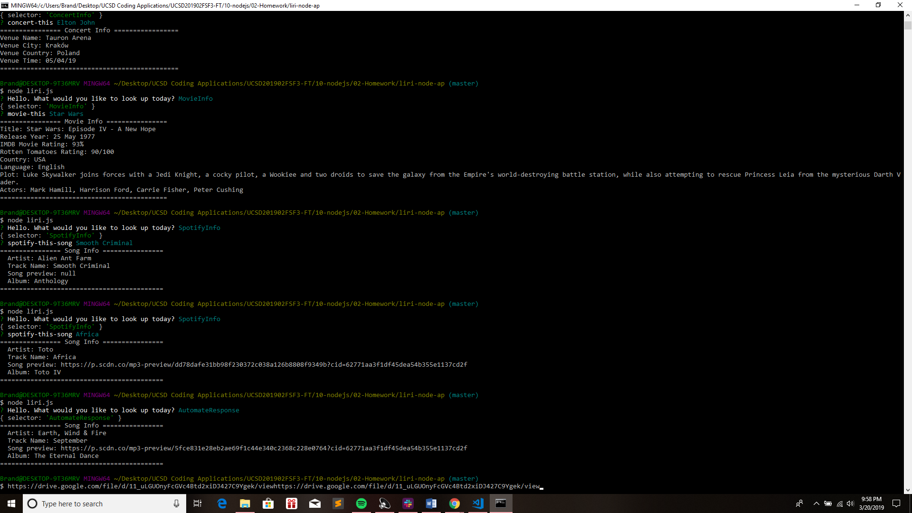

# liri-node-ap
**Week 10 (LIRI Bot) Assignment**

**Assignment Details:**

In this assignment, we were tasked with creating a Liri Bot App.  The Liri Bot App would be responsible for taking in specific arguments from the terminal command line,interrupting those arguments, and then printing a corresponding response in the console.  In this instance, the Liri Bot App will be capable of generating movie, concert, song and automated text file info based on the users choices in the terminal. 

*Functionality Note*:
The choices will be generated using the Inquirer app upon initiating the Liri.JS file using node. 

**APPS USED IN THIS PROJECT**

* Axios
* dotenv
* inquirer
* moment
* node-spotify-api

**GETTING STARTED**
* Clone down this respository
* Open your terminal of choice in the corresponding folder containing the cloned repository  
* Run npm install to install all the necessary packages listed in the depencies section of the package.json file
* In ther terminal, type "node liri.js" to begin the Liri Bot App. 

**INSTRUCTIONS**
1. Once "node liri.js" has been typed in the command line and the Liri Bot App has begun running, a list of options will appear asking the user to choose from 1 of 4 options: 
    1. MovieInfo - (Generates movie info for a given movie.  Generates                  default selection if no movie is entered)
    2. ConcertInfo - (Generates concert info for a given artist.)  
    3. SpotifyInfo - (Generates song info for a given song.Generates                      default selection if no movie is entered)
    4. AutomateResponse - (Generates a preselected song by pulling the                         song name from the random.text file)

2. Once the user chooses from 1 of the 4 listed options below, a follow up prompt will be provided in accordance with what the user chose in the previous list.  The follow up input will be one of three possible options:

    1. movie-this - (a command line prompt that will return movie info                    when a movie title is entered and print it to the                     terminal )
    2. concert-this - (a command line prompt that will return concert                       info when an artist name is entered and print                       it to the terminal)
    3. spotify-this-song - (a command line prompt that will return song                         info when a song name is entered and print                          it to the terminal )

Only 3 prompts possible can be offered up for user input as the AutomateReponse list option does not return a prompt as it automatically generates a response. 

3. That's it!  Hope you enjoyed using Liri Bot :) 

**Screencastify Link:**
* https://drive.google.com/file/d/11_uLGUOnyFcGVc4Btd2xiDJ427C9Ygek/view

**Author:** Brandon Harris 
